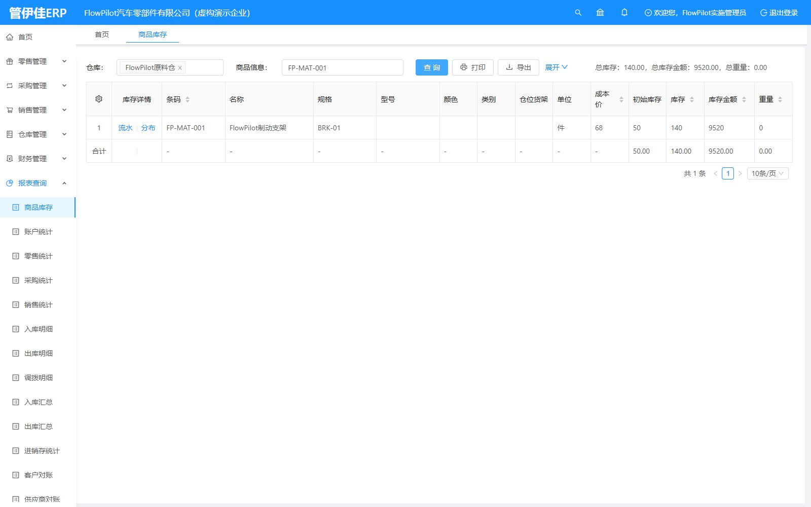

# FlowPilot ERP 制造业进销存系统实施交付

基于开源 [jshERP](https://github.com/jishenghua/jshERP) 的个人实施实战，模拟虚构汽车零部件企业的部署、配置、Excel迁移、采购库存销售联调、UAT和备份恢复。保留上游版权，不声称自主研发ERP或真实企业生产上线。

**已实际运行：** Windows便携部署，http://127.0.0.1:8088。**主UAT：17通过、2失败。** Docker/Linux部署未执行，后端数量及岗位授权缺陷尚未修复，生产验收不通过。



## 实测成果

- jshERP v3.6 / 8f28e7c2fe54d54de3621a414f5df1833dc5a55f；Java8/Spring Boot/Vue/MySQL8.0.44/Redis Windows3.0.504/Nginx1.28.0。
- 3供应商、3客户、6物料、2仓库、4岗位，原生XLS与UTF-8台账迁移。
- 4张有效采购/销售单据：支架采购120件、销售30件，原料仓库存 **50 → 170 → 140**，页面/API/SQL一致。
- 浏览器真实登录、资料编辑、销售单反审核/审核；不足库存和重复提交实测。
- MySQL备份恢复到新测试schema，30表行数和内容哈希一致；四服务重启数据保持。
- [19条主UAT及补充验收](docs/08-UAT验收用例与结果.md)、[实际故障与2项缺陷](docs/09-问题排查与解决记录.md)。

## 当前本机使用

```powershell
Set-Location D:\7800\flowpilot-erp
.\scripts\start.ps1
.\.venv\Scripts\python.exe scripts\native.py status
.\.venv\Scripts\python.exe scripts\sql_verify.py
# 保留数据停止
.\scripts\stop.ps1
```

岗位账号fp_manager/fp_purchase/fp_warehouse/fp_sales，密码读取本地.env中ERP_DEMO_PASSWORD，输入真实页面验证码。凭据不公开。数据库3308、Redis6388、后端9999、Nginx8088均为127.0.0.1监听。

## 兼容环境复现

前提：Windows x64、Git、PowerShell、Python3.10、空闲端口及官方下载网络。克隆交付仓库到D盘，在项目根目录运行：

```powershell
.\scripts\setup.ps1
.\.venv\Scripts\python.exe scripts\migrate.py templates
.\.venv\Scripts\python.exe scripts\migrate.py validate
.\.venv\Scripts\python.exe scripts\migrate.py import
# 仅新演示库执行一次；已有主单时脚本拒绝重复
.\.venv\Scripts\python.exe scripts\business_uat.py
.\.venv\Scripts\python.exe scripts\sql_verify.py
.\.venv\Scripts\python.exe scripts\backup_restore.py
```

setup获取固定运行时和上游commit，应用一处导出路径补丁，使用前端锁文件、MavenCentral及本地缓存构建，生成随机.env、初始化新datadir并启动。不要先复制示例占位密码用于原生部署；不要删除已有datadir重初始化。**本机各组件步骤已执行，干净机器完整setup尚未验证。** 详细版本、下载路径及Linux待验证命令见[部署手册](docs/02-环境检查与部署手册.md)。

Compose与Dockerfile已准备，本机Docker缺失；不把配置文件、静态检查或Windows进程持久化写成容器部署成功。切换Docker前处理端口冲突，保留原数据，禁止down -v。

## 目录和证据

|目录|内容|
|---|---|
|deployment/、compose.yaml|容器配置、Nginx、Maven镜像、固定锁文件、上游补丁|
|scripts/|便携部署、迁移、API/GUI验收、SQL、备份恢复及发布检查|
|data/|虚构CSV与原生/旧台账XLS模板|
|sql/|只读库存、单据、重复数据核对|
|postman/|可导入接口集合与空凭据环境模板|
|docs/|13份实施交付文档及简历项目经历|
|evidence/|真实脱敏请求、SQL、日志、截图、UAT、恢复及哈希清单|
|output/pdf/|一页A4项目经历PDF|

upstream/由脚本取得，.env、.venv、tools、runtime、backups均Git忽略，不打包工具二进制、缓存或数据库密码哈希。

## 交付文档

- [01-项目背景与实施范围](docs/01-项目背景与实施范围.md)
- [02-环境检查与部署手册](docs/02-环境检查与部署手册.md)
- [03-系统架构与服务配置](docs/03-系统架构与服务配置.md)
- [04-基础资料与业务配置说明](docs/04-基础资料与业务配置说明.md)
- [05-Excel数据迁移与SQL核对](docs/05-Excel数据迁移与SQL核对.md)
- [06-采购库存销售业务流程](docs/06-采购库存销售业务流程.md)
- [07-接口联调记录](docs/07-接口联调记录.md)
- [08-UAT验收用例与结果](docs/08-UAT验收用例与结果.md)
- [09-问题排查与解决记录](docs/09-问题排查与解决记录.md)
- [10-数据库备份恢复与上线检查](docs/10-数据库备份恢复与上线检查.md)
- [11-用户操作手册](docs/11-用户操作手册.md)
- [12-实施交付总结](docs/12-实施交付总结.md)
- [13-项目验收与证据清单](docs/13-项目验收与证据清单.md)

## 简历与验收边界

[一页项目经历](docs/项目经历-实施岗.md) · [A4 PDF](output/pdf/FlowPilot-实施岗项目经历.pdf) · [证据清单](evidence/manifest.json)

可展示部署、迁移、业务联调、SQL核对、UAT与备份隔离恢复；不能写Linux/Docker已落地、生产上线、完整权限验收通过或自主研发ERP。Maven构建成功不代表单元测试通过，Postman集合导出不代表Postman GUI全部实测。

## 开源来源与许可

上游固定commit见 [来源与变更](UPSTREAM.md)，许可证见 [LICENSE.upstream](LICENSE.upstream)。实施脚本与文档采用Apache-2.0，见 [LICENSE](LICENSE)。唯一ERP业务源码差异是导出临时目录可配置；未重构前后端。
