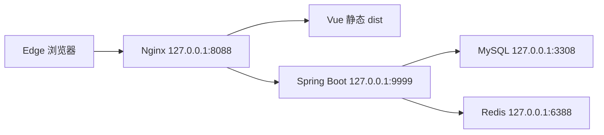

# 系统架构与服务配置

后端接口前缀 `/jshERP-boot`，Nginx 保留该路径反代。SPA history 路由由 try_files 回落 index.html。浏览器业务调用 Nginx 同源接口，不需另设公共 API 地址。

|配置/数据|本机路径|说明|
|---|---|---|
|安全参数|.env|随机密码；Git 忽略|
|后端配置|runtime/application.properties|保留原配置并追加连接、目录和 INFO 日志覆盖|
|MySQL|runtime/my.ini、runtime/mysql|独立端口和 datadir，utf8mb4|
|Redis|runtime/redis.conf、runtime/redis|bind localhost、认证、AOF|
|Nginx|runtime/nginx/nginx.conf|由 native.py 生成，执行 nginx -t|
|实际运行 JAR|runtime/jshERP.jar|从 target 复制，避免构建产物被 Windows 锁住|
|附件与导出|runtime/upload、runtime/exports|本机持久目录|
|进程登记|runtime/processes.json|停止前核验 PID 对应可执行文件路径|

数据库应用用户 `flowpilot` 只有 jsh_erp 的 SELECT/INSERT/UPDATE/DELETE；备份恢复使用本地 root 配置文件，不把密码放在命令参数。数据库对象与约束来自原 SQL，不新增业务表。库存关联 material_id、depot_id，单据 head/detail、material_extend 与条码关联，租户63和 delete_flag 必须同时注意。

Compose 使用服务 DNS mysql、redis、backend，具备健康检查、依赖条件和 named volumes。数据库、Redis和Nginx映射地址限制127.0.0.1，后端仅容器网络可见。Compose 暂未运行，配置设计不等于测试通过。

基础安全：默认密码已轮换，所有本机端口仅 loopback；旧 Spring Boot/Vue/Redis 存在维护风险。npm audit 报告 193 项依赖问题（low 11、moderate 90、high 56、critical 36），包含开发和间接依赖，不等同于同数量可利用漏洞；没有用自动大版本升级破坏兼容。

实测跨角色写入缺陷意味着菜单过滤不能作为服务端授权控制。本系统仅作隔离个人实验，当前不满足生产安全验收。

证据：[deployment-health.json](../evidence/deployment-health.json)、[nginx-config-check.log](../evidence/nginx-config-check.log)、[npm-audit.json](../evidence/npm-audit.json)、[permissions-uat.json](../evidence/permissions-uat.json)。
